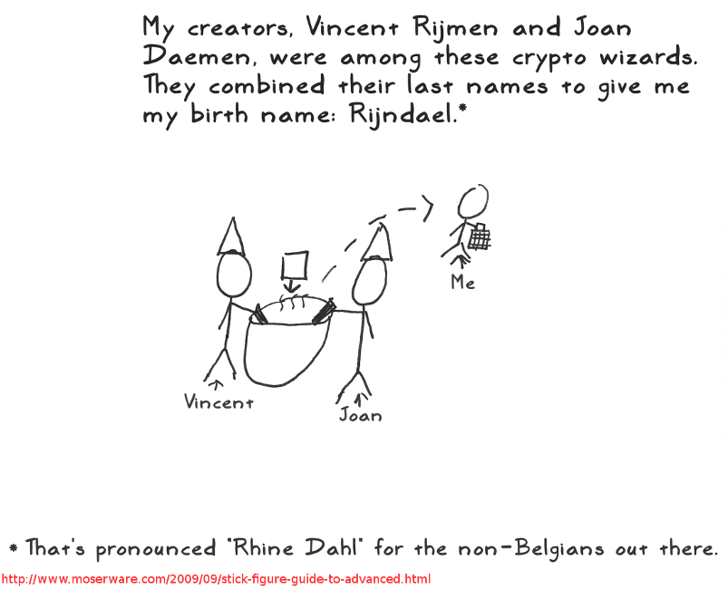

# Rijndael
[](https://github.com/ellerbrock/open-source-badge/) [](https://travis-ci.org/moeenz/rijndael) <br>
A fully implementation of Rijndael encryption in pure Python.
<p align="center">
	
</p>

# Usage
First install rijndael from PyPi
```bash
    pip install rijndael
```
and now you can use encryption/decryption system.
```python
    from rindael.cipher.crypt import new
    from rijndal.cipher.blockcipher import MODE_CBC
    
    rjn = new(KEY, MODE_CBC, IV, blocksize=BLOCKSIZE)
    encd = rjn.encrypt('A padded string to BLOCKSIZE length.')

    rjn = new(KEY, MODE_CBC, IV, blocksize=BLOCKSIZE)
    decd = rjn.decrypt('A padded string to BLOCKSIZE length.')
```


# Chaining Modes
```rijndael``` supports multiple chaining modes.
* Right now these chaining modes are supported:
    * MODE_ECB
    * MODE_CBC
    * MODE_CFB
    * MODE_OFB
    * MODE_CTR
    * MODE_XTS
    * MODE_CMAC


# Source
This project is forked from [python-cryptoplus](https://github.com/doegox/python-cryptoplus).


# License
The MIT License (MIT)

Copyright (c) 2017 rijndael Project.

Permission is hereby granted, free of charge, to any person obtaining a copy
of this software and associated documentation files (the "Software"), to deal
in the Software without restriction, including without limitation the rights
to use, copy, modify, merge, publish, distribute, sublicense, and/or sell
copies of the Software, and to permit persons to whom the Software is
furnished to do so, subject to the following conditions:

The above copyright notice and this permission notice shall be included in
all copies or substantial portions of the Software.

THE SOFTWARE IS PROVIDED "AS IS", WITHOUT WARRANTY OF ANY KIND, EXPRESS OR
IMPLIED, INCLUDING BUT NOT LIMITED TO THE WARRANTIES OF MERCHANTABILITY,
FITNESS FOR A PARTICULAR PURPOSE AND NONINFRINGEMENT. IN NO EVENT SHALL THE
AUTHORS OR COPYRIGHT HOLDERS BE LIABLE FOR ANY CLAIM, DAMAGES OR OTHER
LIABILITY, WHETHER IN AN ACTION OF CONTRACT, TORT OR OTHERWISE, ARISING FROM,
OUT OF OR IN CONNECTION WITH THE SOFTWARE OR THE USE OR OTHER DEALINGS IN THE SOFTWARE.

---------------------------------------------------------------------------
Third party implementations are distributed under their respective license
as specified in their source file(s):

    Ciphers:
     pyblowfish.py, pyDes.py, pyserpent.py, pytwofish.py, rijndael.py
     - pyblowfish.py is being redistributed under the Artistic License

    Hash functions:
     pypbkdf2.py, pywhirlpool.py
     using pypy license: pysha.py, pysha224.py, pysha256.py, pysha384.py,
     pysha512.py, pymd5.py
---------------------------------------------------------------------------